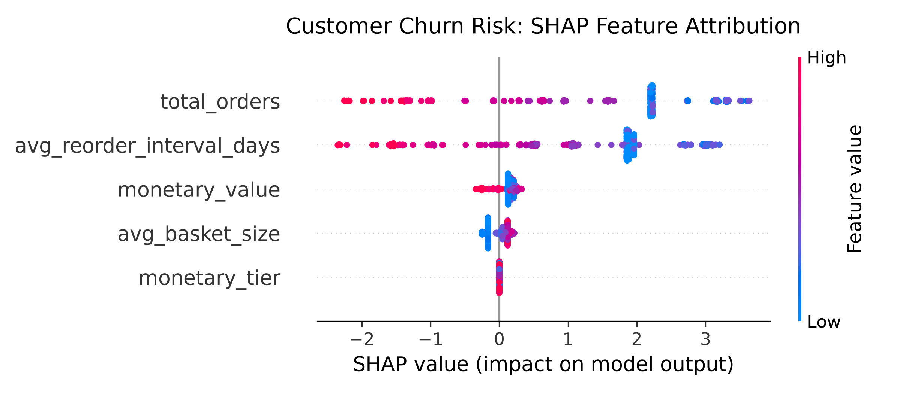

# Commercial-data-science
End-to-end commercial analytics pipeline using SQL and Python: cohort RFM segmentation, customer lifetime value, and churn risk classification.

# 📊 Commercial Customer Intelligence & Churn Engine

[](https://duckdb.org/)
[](https://www.python.org/)
[](https://xgboost.readthedocs.io/)
[](LICENSE)

An end-to-end commercial data science pipeline coupling in-process analytical SQL transformations (DuckDB) with class-balanced gradient boosted classification (XGBoost) and SHAP feature attribution.

---

## 📌 Technical Pipeline Architecture

```text
[Raw Transaction Logs (CSV)]
              │
              ▼
[DuckDB Analytical SQL Engine]
  ├── Multi-Stage CTEs (`sql/01_customer_rfm.sql`)
  ├── Window Functions (`LAG`, `NTILE(5)`)
  └── Behavioral Aggregations (Recency, Interval Dynamics, Monetary Tiers)
              │
              ▼
[Curated Feature Vector]
              │
              ▼
[XGBoost Classifier] ─── Cost-Sensitive Imbalance Correction (`scale_pos_weight`)
              │
              ▼
[SHAP Attribution Engine] ─── Local & Global Explainability (`TreeExplainer`)
```

---

## 🔬 Model Performance & Minority Class Handling

The customer cohort exhibits significant natural churn imbalance (362 churners vs 13 retained accounts in the test partition). Standard models default to predicting the majority class to artificially inflate accuracy; applying cost-sensitive reweighting via `scale_pos_weight` recovers minority class sensitivity:

```text
=== CLASSIFICATION REPORT (CLASS BALANCED) ===
              precision    recall  f1-score   support

           0       0.26      0.85      0.40        13
           1       0.99      0.91      0.95       362

    accuracy                           0.91       375
   macro avg       0.63      0.88      0.68       375
weighted avg       0.97      0.91      0.93       375

ROC-AUC Score: 0.9644
```

* **High Minority Recall (0.85):** Captures 85% of at-risk retained customers, minimizing costly false negatives in retention campaigns.
* **Separation Rigour (0.9644 ROC-AUC):** High rank-order discrimination between active and churning accounts across threshold variations.

---

## 📊 Feature Attribution & Global Interpretability



* **Order Recency & Interval Drift:** Extended intervals between purchases and high recency days are the primary drivers shifting predictions toward churn.
* **Monetary Tiering Dynamics:** High-frequency purchasers situated in upper `monetary_tier` quartiles demonstrate resilient retention thresholds even during intermittent inactive periods.

---